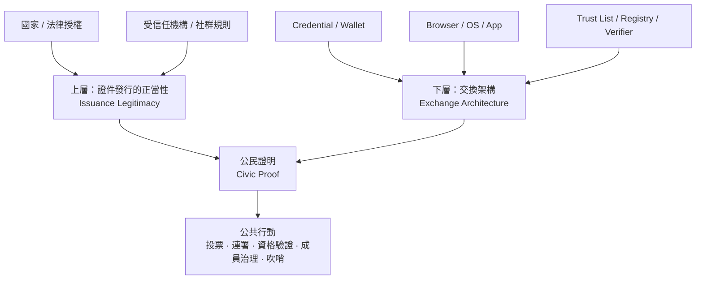
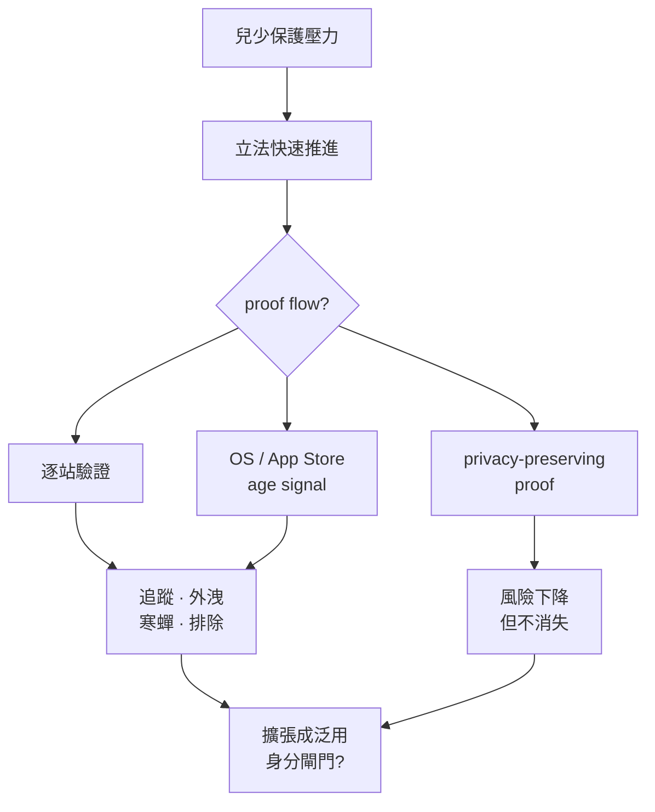
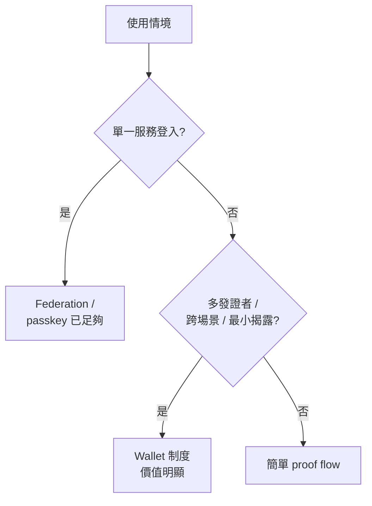
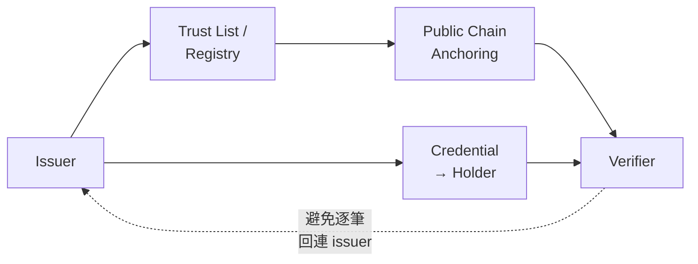

> 簡報投影片：[中文版](https://mashbean.net/blog/allen-lab-share-0417-zh/) ｜ [English](https://mashbean.net/blog/allen-lab-share-0417-en/)

上一次 Allen Lab 的會議，Jeremy McKey 幫大家從支付（Payment）的角度切進數位公共基礎設施（Digital Public Infrastructure, DPI）。今天我想接著補上另一塊拼圖，也就是身分（Identity）。若沿用目前常見的 DPI 三分法，討論通常會落在資料（Data）、支付（Payment）、身分（Identity）這三塊。Allen Lab 在 Data 上已經累積很多材料，並且處理了非常多開放資料如何提升公民行動的案例，因此所以今天我想補上最後這一塊，也就是數位身分。

我自己過去一年大約有一半的時間都在這個題目裡面。過去兩年半我在台灣的數位發展部進行數位皮夾的推動與規劃。去年中離開政府之後，我持續做數位身分的政策研究，也參與一些公民場景的實驗，例如示範性地採納零知識證明（Zero-Knowledge Proof, ZKP）、協助開放社群平台思考如何介接身分，以及如何在不揭露完整身分的情況下建立可驗證的資格。與此同時，因為另一條工作線的關係，我也非常關注離散社群與流亡社群如何採用新興科技。我原本以為這會是一個數位民主題目，後來發現裡面反覆碰到的其實是數位身分。東歐、加泰隆尼亞、城市級民主實驗，很多都在碰同一個問題：人要如何在數位空間裡證明「足夠的資格」，又不要因此把自己交給國家、平台或任何單一中介者。

真正讓我把這些材料串起來的，是來到 Allen Lab 之後接觸到數位公民建設（Digital Civic Infrastructure, DCI）這個概念。我開始意識到，自己真正關心的方向，不只是大型國家專案能否制度化，也不只是商業服務能否穩定接入。更核心的問題是數位身分能不能成為一種支撐公民行動（civic action）的基礎設施。它能不能幫助人連結、理解、行動，同時避免過度揭露、過度追蹤與過度排除。Danielle Allen 與 Allen Lab 將 DCI 理解為一套支撐公民**連結（Connect）、學習（Learn）、行動（Act）**的[制度與技術條件](https://ash.harvard.edu/resources/a-framework-for-digital-civic-infrastructure/)，因此我的核心關懷是數位身分如何決定一個人能否從連結走向行動。

我一直認為數位工具在所謂「數位集會」的階段已經有許多成功案例，甚至有許多國家的政權轉換，數位集會扮演重要的角色，但是「數位結社」一直都沒有非常好的案例。我認為有一個很重要的原因是因為「結社」的底層，也就是「數位身分」，並沒有很好的基礎。這是我未經實證的假設，但我的推論是因為「數位身分不夠隱私」，因此「數位身分所衍伸的秘密結社」一直無法有效實踐，更不用談數位行動主義的成效了。

因此本文的焦點放在一個更窄、也更政治的問題——什麼樣的數位身分架構，能讓公民在數位空間中低門檻、低暴露、可救濟地行動。只把證件搬到手機上，對我來說只是數位身分政策演進過程中的必然結果，屬於公共服務數位轉型的範疇。更深的問題牽涉國家權力、平台責任、公民自由、跨境互通，以及公共空間的進入條件。這也是我想把身分重新放回 DCI 脈絡來談的原因。

## 為什麼數位公民基礎設施一定要談數位身分

如果把 DCI 看成一套讓公民得以連結、理解並行動的制度堆疊，那麼數位身分最敏感的位置，會出現在系統開始管制行動（gate action）的瞬間。

在連結（Connect）這一層，身分主要處理的是持續性、社群治理、角色分工與基本信任。例如社群裡面誰是誰、誰能擔任管理者、誰能維持一個長期的貢獻紀錄。我在 參與零時政府（g0v）——台灣最大的公民科技社群——所獲得的經驗是，開源協作的社群並沒有管制行動的問題，因為人與人之間的信任建構在長期貢獻之中。相關術語叫做「做中學」（Do-ocracy）、「用做來取得信任」（Trust through contribution），或者源自於 IETF 的術語「粗略共識與可執行的程式碼」（Rough consensus and running code）。在這樣的公民行動社群中，強大的貢獻者甚至是可以匿名的，因此數位身分只是一個象徵性的信任錨點（trust anchor），不涉及任何數位服務。過去也有許多試圖紀錄開源貢獻的專案（如 Web3 的 Hypercerts），但大多失敗了，可能是因為任何量化指標，都無法取代社群自然累積的社會資本。

到了學習（Learn）這一層，許多資訊取得與討論其實不需要強身分。不需登入的資料閱讀、低門檻的參與討論或者僅需弱連結的參與，往往仍然成立。

真正的政治壓力落在行動（Act）。只要系統開始問你有沒有資格、有沒有重複投票、是否屬於某個區域的人、年齡是否達標、你的參與是否符合程序、是否必須對某個結果負責，數位身分就會進入公共決策（public decision）的核心。從那一刻開始，身分不再只是登入細節，它會直接參與公共資源分配、公共空間的進入條件，以及數位公共生活的正當性結構。DCI 框架把連結、學習、行動視為彼此連動的公民參與入口；我的觀察是，身分在這三者裡最強烈地介入行動。因為行動可能與公共服務接壤，包含吹哨、投票、附議、參選、長期結社治理等等。

因此，我想提出三個命題來繼續推論。第一，主流數位身分體系其實已經相當成功，尤其在服務交付、認證、簽章、合規與詐欺防制（fraud reduction）上。第二，當身分基礎設施開始進入年齡驗證、平台治理與公共空間入口時，它就開始決定誰能進入哪些空間、使用者需以何種條件進入。第三，皮夾（wallet）、選擇性揭露（selective disclosure）、不可連結性（unlinkability）、零知識證明（ZK）以及瀏覽器 API 的成熟，讓較民主的數位身分設計第一次進入政策與產品的可行區，但制度治理明顯落後於技術可能性。

## 從數位身分到公民證明

==可問責並不需要以實名為前提==

我建議把數位身分先拆成兩層再談。第一層是**證件發行的正當性**（issuance legitimacy），也就是誰有權核發證件，導致涉及公民權利義務的效果（civic consequences）。這一層處理的是法律效力、主權、制度問責、撤銷權，以及一個憑證（credential）為什麼值得被相信。第二層是**交換架構**（exchange architecture），也就是憑證如何被持有、如何被出示、誰來驗證、如何撤銷、如何跨越單一系統被重復使用、以及整個流程會不會留下可追蹤的痕跡。前者是制度層面，後者涉及技術層面，但是彼此息息相關。將這兩層拆開之後，很多看起來混在一起的爭論就會清楚很多。公鑰基礎建設（PKI）、可驗證憑證（Verifiable Credentials, VC）、皮夾（wallet）、瀏覽器（browser）、信任清單（trust list）、信任註冊表（trust registry），各自在不同層發生作用。

以下的流程圖呈現這個兩層模型如何匯流為公民證明，再支撐具體的公共行動：

我想引入一個新的詞彙，叫做**公民證明**（civic proof）。這個詞的作用是把焦點從「證件本身」移到「能不能支撐公共行動的證明形式」。很多時候，公民行動並不需要完整的法律身分（legal identity）。它需要的可能只是一個**屬性證明**（attribute proof），例如證明你年滿 18 歲，或你住在某個轄區。它也可能只需要**唯一性證明**（uniqueness proof），例如一人一票、一人一帳號，防止濫用攻擊（Sybil Attack），卻不需要知道你的真名。再往政治敏感場景走，還會碰到**假名式參與**（pseudonymous participation），也就是你必須能參與、能發言、能貢獻、能被事後稽核，但不必在平常狀態下暴露真實身分。這四種需求若不先拆開，後面所有關於公民使用數位身分參與公共事務的討論，都會變得模糊。

規範上，我會用四個條件來檢查制度，並且根據不同需求、制度設計、架構設計來驗證四個條件是否滿足：**匿名**（anonymity）、**不可連結**（unlinkability）、**可驗證**（verifiability）、**可問責**（accountability）。

下表整理四種公民證明的需求型態，以及它們各自對兩層架構的要求：

| 需求型態 | 典型場景 | 上層需要什麼正當性 | 下層需要什麼交換架構 | 對自由與隱私的最低要求 |
|---|---|---|---|---|
| **法律身分（Legal Identity）** | 報稅、具法效簽章、領取法定給付 | 國家或法律授權的根身分 | 強保證、可撤銷、可追訴 | 可驗證、可救濟 |
| **屬性證明（Attribute Proof）** | 年齡、居住資格、學生、會員 | 可驗證的屬性來源 | 選擇性揭露、最小揭露 | 不可連結、不回撥 |
| **唯一性證明（Uniqueness Proof）** | 一人一帳、一人一票、論壇藍勾勾 | 唯一性來源可被信任 | 去重、抗 Sybil、低揭露 | 假名、不可連結 |
| **假名式參與（Pseudonymous Participation）** | 吹哨、敏感諮詢、政治討論 | 程序正當性與事後問責機制 | 保留匿名、保留稽核可能 | 匿名、可問責、受監督 |

這四個條件必須同時成立，不能互相替代。其中在我參與新型態數位身分的各種專案中，我發現一個違反直覺、但是在密碼學（或政治哲學？）上自洽的狀態是——**可問責並不需要以實名為前提。** 這句話會貫穿後面所有段落。因為很多原本被認為只能靠個資全部揭露（完整身分識別）解決的問題，就會出現新的制度空間。

## 各國發行憑證比較

如果從上層的證件發行的正當性來看，高保證力的信任根所產生的數位身分，在今天仍然多半由國家，或由國家承認的制度提供。這一點沒有真正改變。個人自發行身分（如以太坊地址）、公民團體自發行的身分（如工會會員、俱樂部、協會等等），或者企業發行的身分（如 Gmail），基本上都無法真正滿足法律證明（legal proof）、屬性證明（attribute proof）的需求，而在唯一性證明（uniqueness proof）或假名式參與（pseudonymous participation）方面，有許多實驗性的專案出現（如 Web3 領域的 Gitcoin Passport，但該專案已經被轉手轉換方向了），但這些實驗性的專案，最後都採用國家發行的證件為主（如 zkPassport）。我認為主因還是在「人民，即使是他國人民，還是比較相信主權國家的身分發行權力」。

這十年來，真正開始分化的是下層交換架構，也就是憑證如何被持有、如何被呈現、誰能驗證、誰能加入生態、誰控制信任清單、誰承擔接入成本（onboarding cost）。這一層的差異，會直接改變數位身分能不能介入 DCI 的行動層。真正啟動改變的歷史脈絡是 COVID-19，因為疫苗護照具有非常多敏感個資，開始有不同標準制定組織提出「去中心身分」的概念，去對應過去由政府資料庫儲存、使用的「中心化身分資料庫」，去避免政府監控的風險。這個領域後來衍伸出可驗證憑證（Verifiable Credential）、去中心化識別碼（Decentralized Identifier, DID），甚至應用零知識證明等等的領域。

以下是三組主要比較：

| | 上層：證件發行的正當性 | 下層：交換架構 | 目前優勢 | DCI 缺口 |
|---|---|---|---|---|
| 🇹🇼 **台灣** | MOICA 具法效；TW DIW 多發證者生態 | PKI + wallet / VC 雙軌 | 法效清楚，政策試驗彈性上升 | 生態接入摩擦與公民負擔並存 |
| 🇪🇺 **歐盟** | eIDAS trust services、各國信任清單 | EUDI Wallet、attestation、selective disclosure | 法制完整、跨境互通有正式框架 | 規則複雜；wallet / browser 成新守門者 |
| 🇸🇪 **瑞典** | 商業 BankID 為事實基礎設施；政府補位中 | 高日常採用、平台化成熟 | 使用頻率高、社會滲透深 | 單一商業 operator 依賴、納入性風險 |
| 🇺🇸 **美國** | 州級 mDL、州法、州級 wallet | 標準成熟、部署分散 | OS 與市場影響力強 | 全國制度碎片化、州際差異大 |

**台灣**同時存在自然人憑證（MOICA）這條高保證力、強法效、以發證者為中心（issuer-centric）的路徑，以及數位皮夾（TW DIW）這條朝多發證者、場景化出示、選擇性揭露前進的皮夾路徑。

**歐盟**的上層仍然是 eIDAS 信任服務（trust services）與各國信任清單（national trusted lists），下層則由歐盟數位身分皮夾（EUDI Wallet）將認證（attestation）、皮夾持有、使用者同意與跨境呈現整合在一起。

**瑞典**最有趣的地方在於，社會高度依賴商業的 BankID，有企業壟斷的風險，央行因此公開主張政府電子身分識別應成為重要補充。這說明商業身份系統可以非常深入社會生活，但公共治理問題並不會因此消失。

補充對照：

| | 上層：證件發行的正當性 | 下層：交換架構 | 目前優勢 | DCI 缺口 |
|---|---|---|---|---|
| **[MOSIP](https://mosip.io/)** | 各國自建的模組化身分基礎設施 | 開源、模組化、可在地部署 | 對多國具成本與主權吸引力 | 是否支撐公民權利取決於各國治理 |
| 🇮🇳 **Aadhaar** | 國家級巨大規模根身分 | authentication / eKYC 導向 | 規模與覆蓋度極高 | 高規模 ≠ 高自由保障 |
| 🇧🇹 **不丹 NDI** | 主權支持的 National Digital Identity | 受信任的皮夾、VC 導向 | 國家級創新方向 | 國際互通與治理成熟度仍在形成 |

再往外看幾個補充對照。美國不是單一路徑，而是州級與市場平台交錯的叢集。加州的 OpenCred 和皮夾生態、猶他州的數位身分權利語言，都很值得觀察。MOSIP 以全球南方為主，提供的是一種模組化、開源、可由國家自行擁有的基礎設施想像。印度的 Aadhaar 則提醒我們，大規模驗證與高覆蓋度不等於公民自由優先（civic-freedom-first）。至於不丹，它的價值在於主權支持的國家數位身分（NDI）路線已經把受信任的皮夾與可驗證憑證放進國家級方向之中，是值得持續觀察的高訊號案例。

世界各地的競爭焦點，已經從「誰有權發行身分」擴大成「誰控制信任清單、誰控制呈現介面、誰承擔驗證方接入與生態成本」。數位身分進入 DCI 的關鍵，不在身分的信任根源是否存在，重點在於信任根源被什麼樣的交換架構運作。

## 台灣的自然人憑證（MOICA）與數位憑證皮夾（TW DIW）

台灣的兩項政策案例值得直接比較，因為它同時包含警示案例（warning case）與公民科技試驗場域（testbed）。

MOICA 是台灣的自然人憑證，也就是傳統的公鑰基礎建設晶片卡，後來也有推出行動應用程式的服務。它提供基於電子簽章法的高保證力、具有明確法律效力，以及相對清楚的政府流程整合能力。對許多由政府主導的數位公共服務來說，這非常重要。

2020 年，台灣政府甚至想要將 MOICA 與紙本的國民身分證整合，名為 New eID，但[遇到大量民眾反彈](https://mashbean.net/facebook/2026/0103-miefwt/)，普遍意見認為 New eID 缺乏法律授權，而且有資安風險，因此最後暫緩。New eID 目前仍然不會推出，而且在政府內部成為冷凍的方案。

以 DCI 的框架來看，MOICA 的問題核心不在公鑰基礎設施，也不在憑證本身。真正的問題在於開放生態的接入摩擦、申辦資格、臨櫃流程、第三方介接成本，以及整體制度高度以發證者為中心。MOICA 官方的身分確認服務甚至明確要求應用系統先提出申請並獲准，才能取得相關能力。這種設計非常適合高度控制且高度問責的場景，但對第三方公民服務來說，摩擦就會很高。

TW DIW 走的是另一條路。它的官方路徑不是再發一張集中式國民數位身分，而是把政府與民間既有憑證轉成可由持有者管理的數位憑證卡片。TW DIW 過去開源了發行者與驗證者的模組，也於今天（2026.04.17）開源了行動應用程式的程式碼，算是一個很重要的里程碑。目前有電信商的電信卡，支援便利商店領取網購貨物。未來應該會支援工商憑證與駕照。

TW DIW 的政策設計上強調選擇性揭露、互通性、開放生態、以及多發證者與多驗證者的可能性。這讓它在 DCI 的視角下變得很有潛力，因為公民行動很多時候需要的不是高度管制的中央身分控制，而是更佳便利、更具有可組合性、更低揭露的證明。

不過，TW DIW 所涉及的公民科技應用問題，如公民如何藉由數位皮夾強化行動，不能僅理解為採用上的門檻；更精確地說，它牽涉的是**公民負擔的重新分配**（civic burden redistribution）。由於 DIW 可以容納多種機構發行的數位身分，多重信任根、多重信任清單與多元發證者固然擴大了生態系的可能性，卻也同時將理解、授權、驗證、申訴與責任判定的成本，更大程度地轉嫁到民眾與驗證者身上。

以下對照表整理兩套系統在 DCI 視角下的關鍵差異：

| 向度 | MOICA（自然人憑證） | TW DIW（數位皮夾） |
|---|---|---|
| **設計中心** | 發證者、法定效力、身分識別、電子簽章 | 持有者、憑證卡片跨場景重用 |
| **典型任務** | 身分識別、數位簽章、加解密 | 屬性出示、跨場景憑證、選擇性揭露 |
| **第三方介接** | 需正式申請、審查、獲准接入 | sandbox 較開放，issuer / verifier 入口較寬 |
| **揭露邏輯** | 偏高強度確認，甚至完整身分確認 | 分場景授權與最小揭露 |
| **主要摩擦** | 臨櫃、資格、API 審查、接入成本 | 使用者理解、驗證者整合、trust list 治理 |
| **DCI 啟示** | 強憑證足夠支撐政府流程，未必足夠支撐公民行動 | 應用空間變大，公民負擔也分散到公民與驗證者 |

MOICA 的摩擦，比較集中在進場前，也就是申請、審查、接入。TW DIW 的摩擦，則比較集中在生態運作中，也就是你如何理解自己手上的憑證、你信不信這個發證者、驗證者要怎麼驗、發生爭議時誰負責。這對 DCI 很重要，因為公民基礎設施不是只有技術能不能跑得動，還包括一整套使用與問責成本的分配。

以下有兩個正在進行中的案例，說明公民科技社群如何應用這些既有的公共服務，進行公民行動。

### 案例 A：PTT 透過自然人憑證進行匿名所在地證明

台灣最大的 BBS 系統 PTT，到目前仍然有數十萬人使用，但該平台長期受到選舉前協同行為與網軍操作的困擾，志工團隊很難靠傳統內容審核解決。今年（2026）是台灣地方選舉年，工程團隊以自然人憑證產生零知識證明，讓使用者在不揭露真實身分的情況下拿到「藍勾勾」，去降低網軍攻擊的頻率。這件事證明了國家根憑證可以提供信任根，但不必把完整身分交給平台，也不必讓平台知道具體是誰。這正是一種從國家憑證轉成公民證明的具體路徑。

### 案例 B：g0v Summit 透過數位憑證皮夾發行入場券

另一個同樣重要的方向，是 g0v Summit 2026。g0v 是台灣最大的公民科技社群，每兩年辦一次年會。今年 g0v 志工團隊將使用數位皮夾發放證件與入場憑證，並由非政府的第三方擔任發證者與驗證者。這會直接證明一個以持有者為中心（holder-centric）的生態不是只能由政府單獨操作。公民社群、活動組織者、非官方的驗證者也可以在信任框架之中運作。它和 PTT 案例剛好形成對照：前者是拿強國家憑證產生低揭露的公民證明，後者則是用皮夾架構擴大非政府發證與驗證的實作空間。

## 年齡驗證是最好的國家數位身分政策壓力測試

我認為年齡驗證很容易從保護兒少滑向普遍化的存取控制。這也是為什麼年齡驗證是「數位身分作為公共基礎設施」最具張力的部分。它把原本位在後台的身分基礎設施，直接推到公共空間與言論場域的入口。當一個人要進入某個服務、某個討論空間、某類內容、某種社會互動時，系統先要求提出年齡證明，身分就正式介入了公共空間的進入條件。

這波年齡驗證立法的速度，明顯快過技術標準與人權評估的節奏。在國際標準《ISO/IEC 27566-1》這個第一個年齡驗證國際標準於 2025 年 12 月出版之前，美國多州已立法、英國已開始執法、澳洲法律也已生效。更重要的是，這個標準本身明白寫出，年齡驗證的目標是作成年齡相關的資格判定，而且「取得年齡保證」並不必然需要建立一個人的完整身分。

以下表格整理四個主要法域的年齡驗證制度動向：

| | 制度動向 | 關鍵時間點 | 核心張力 |
|---|---|---|---|
| 🇬🇧 **英國** | Ofcom 要求 highly effective age assurance，允許多技術路徑 | 2025-07 起色情網站需強年齡查核 | 監理強度高，隱私標準未必一致 |
| 🇦🇺 **澳洲** | 社群媒體最低年齡限制，要求平台採 reasonable steps | 2025-12 生效，2026-03 合規更新 | 平台責任、有效性、誤阻 |
| 🇪🇺 **歐盟** | Age verification app / blueprint 與 EUDI 路線接合 | 2025 blueprint，2026-04 可部署 | 最小揭露能否制度化 |
| 🇺🇸 **美國** | 從州級內容 gate 走向 device / OS / app-store age signal | 2025-06 Paxton 案；2025-10 CA AB1043 | 從「色情門檻」滑向「基礎設施層年齡訊號」 |

英國、澳洲與歐盟給了三條成熟但不同的比較路徑。英國通訊管理局（Ofcom）的模式是高監理強度加技術中立。它要求年齡驗證必須在技術上準確、穩健、可靠且公平，並列出開放銀行、照片證件比對、臉部年齡估計、行動網路業者年齡查核、信用卡查核、數位身分服務、以電子郵件為基礎的年齡估計等方法。這個做法的優點是彈性很高，缺點是平台可能會選擇最便宜、最容易部署的方案，而最便宜的方案未必最隱私友善。澳洲則更強調平台責任與實施後監理，2025 年 12 月 10 日生效後，澳洲網路安全專員（eSafety）在 2026 年 3 月發布合規進度更新（compliance update），持續檢視平台是否採取了足夠的合理措施。歐盟的方向則試圖把「只證明已滿十八歲」做成制度化設計，2026 年 4 月，歐盟執委會（Commission）已宣布年齡驗證應用程式（age verification app）可部署，並以護照或身分證件進行初始化設定。

美國方面，2025 年 6 月 27 日，美國最高法院在「言論自由聯盟訴帕克斯頓案」（Free Speech Coalition v. Paxton）中，以六比三裁定德州成人內容年齡驗證法合憲。多數意見明白寫道，年齡證明是執行年齡限制的一種通常且適當的手段。這是個關鍵轉折，因為它將年齡驗證從先前長期被視為高度可疑的言論負擔，至少在「對未成年人有害的性內容」這個脈絡下，轉成較容易被接受的合憲手段。電子前哨基金會（EFF）隨後提醒，這個判決的法律推理其實侷限於未成年人本來就無權接觸的性內容，並未自動授權對社群媒體、一般網站或應用程式商店套用更廣泛的年齡門檻。也就是說，法律範圍是有限的，政策動能卻沒有停在那裡。

帕克斯頓案（Paxton）的法律邏輯侷限於特定內容，但政策實作很快往更底層移動。加州 2025 年簽署的第 1043 號法案《數位年齡驗證法》（AB1043, Digital Age Assurance Act），要求作業系統提供者（operating system provider）在帳號建立時，要求帳號持有人填寫使用者的出生日期或年齡，並以即時應用程式介面（real-time API）向開發者提供年齡區間訊號（age bracket signal）。更關鍵的是，開發者必須在應用程式被下載與啟動時請求這個訊號。這代表年齡驗證已經不再只是某一類網站的內容門檻，而是在往裝置、作業系統、應用程式發行的基礎設施層下沉。加州這部法也加入了一些保護條款，例如只傳送最小必要資訊，並禁止將合規資料用於反競爭用途。伊利諾州的《數位年齡驗證法》提案（Digital Age Assurance Act），雖然尚未通過，也沿著同樣方向想把年齡訊號寫進裝置、作業系統、應用程式商店這一層。這些案例放在一起看，就很清楚了，美國的真正轉折點不只是一個成人內容判決，而是從內容門檻走向基礎設施訊號。

我想加入第五個隱性問題。前面四題大家很熟悉：誰來發證明、揭露多少資訊、能否追蹤、如何救濟。真正更深的一題是「會不會從特定內容控管」，擴張成「廣泛的身分管控」？如何避免**結構性滑坡**？。加州 AB1043 的年齡訊號模型、英國從《線上安全法》到更廣義的皮夾與數位身分討論、歐盟把年齡驗證放入歐盟數位身分皮夾（EUDI）的案例，以及美國州法從成人網站走向社群媒體、裝置層級訊號，全部都在指向——基礎設施一旦建成，新政策就會傾向搭便車。

年齡驗證造成的衝擊，至少有四個面向：

| 權利面向 | 風險型態 |
|---|---|
| **隱私** | 證件、年齡、生物特徵被集中處理 |
| **匿名** | 合法瀏覽與匿名權衝突 |
| **言論自由** | 成人被迫自我審查（寒蟬效應） |
| **數位落差** | 無證件 / 無銀行帳戶者被排除 |

以下流程圖呈現年齡驗證從兒少保護壓力出發，可能走向的不同路徑與風險：

此外還有集中式第三方驗證服務商的資安風險。2025 年，Discord 承認，其第三方供應商 5CA 事件中，約 70,000 名使用者用於年齡相關申訴的政府證件照片，可能遭到曝露。另外還有族繁不及備載的了 Tea、AU10TIX、IDMerit 等事件。這些案例的共通點在於，一旦年齡驗證採取集中式文件上傳與外包服務模式，它就會形成高價值攻擊目標。因此這頁不能只談憲法上的言論負擔，也要談營運安全負擔。

不過好方案是存在的。法國的雙重匿名（double anonymity）、歐盟正在推的應用程式與歐盟數位身分皮夾（EUDI）路線、西班牙先前的零知識證明年齡驗證嘗試，都說明了年齡驗證並不必然等於完整身分上傳。EUDI 的架構文件也直接寫到，選擇性揭露、使用者核准、防止追蹤、甚至以零知識證明實作的「我已滿十八歲」，都在被視為正當方向。關於年齡驗證的完整政策分析，可參考我的[年齡驗證與數位權利報告](https://pro.mashbean.net/reports/2026-04-16-age-verification-digital-rights/)。

## 從完整身分識別走向最小證明

年齡驗證是一個非常好的案例，揭示了「政策」先於「技術」會出現什麼問題。

年齡驗證就是一個典型的屬性證明，有兩種數位身分的證明方案：完整身分識別（full identity）與最小證明（minimal proof）。以下對照表說明在不同問題情境下，兩種方案的差異：

| 問題 | 完整身分識別 | 最小證明 |
|---|---|---|
| 你滿 18 歲嗎 | 出示出生日期、完整證件 | 只證明 over 18 |
| 你住在某地嗎 | 出示完整地址或戶籍 | 只證明居住資格 |
| 你是同一個人嗎 | 交出真名、身分號碼 | 唯一性 proof 或假名 credential |
| 你有某種資格嗎 | 交出整張證件 | 只出示特定屬性 |今天的技術成熟度，已經不是技術做不做得到，而是哪些情境應把最小證明當成預設。很多時候，我們需要的只是某一個條件是否成立，例如年滿 18 歲、居住在某個區域、擁有學生資格、屬於某個會員。若系統每次都要求完整身分識別，就等於把過度揭露制度化。相反地，若系統能以選擇性揭露（selective disclosure）、不可連結性（unlinkability）、不回撥（no-phone-home）來設計證明流程，數位身分才有機會支撐較民主的公共空間治理。

以下決策樹可以幫助判斷何時需要皮夾：

另外皮夾是否必要？我的回答是條件式的。若需求只是單一服務登入，聯合登入（federation，像是 Sign in with Google）、通行金鑰（passkey）或既有高保證力登入工具常常已經足夠。當需求變成多發證者、跨場景重用、最小揭露、使用者同意、跨境互通，皮夾的制度價值就會顯著上升。因為這時候皮夾不只是容器，它還承擔呈現（presentation）、同意（consent）、憑證管理（credential management）、以及不同發證者之間的組合邏輯。美國國家標準與技術研究院（NIST）把「訂閱者控制的皮夾」（subscriber-controlled wallets）納入模型，其實就是在承認這件事。

我也想強調「呈現層正在快速平台化」。當皮夾、作業系統、瀏覽器開始成為數位憑證的預設出入口，真正的競爭就從「誰核發身分」擴大成「誰控制身分的呈現與同意介面」。Google Wallet、Chrome、Apple Wallet、EUDI 的瀏覽器中介呈現（browser-mediated presentation），全部都在往這個方向走。這代表平台層已經不是中性的。它可能成為新的守門者（gatekeeper），也可能成為權利保護的新位置。EUDI 對瀏覽器與作業系統的限制條款、Google 對不追蹤伺服器（no server tracking）的表述，都說明這一層正在被制度化。

最後，以太坊基金會的隱私與擴展性探索團隊（Privacy and Scaling Explorations, PSE）值得一提。因為最小證明與零知識證明息息相關，若最小證明要進入真正可用的公民場景，光有標準還不夠，還需要客戶端證明（client-side proving）的性能突破、撤銷（revocation）的可用設計、以及讓手機或一般消費裝置足以承擔證明的工程化努力。PSE 把客戶端證明與零知識身分（zkID）放到發展路線上，並在 2026 年持續討論 GPU 加速與撤銷機制，這讓零知識證明不再只是研究語言，也開始成為產品與公民實驗可依賴的技術基礎。

## 公民與次國家實驗

當主流制度未充分支援低暴露、可攜、可驗證的公民證明，公民與次國家實驗就會出現。這些專案最重要的價值，不是它們已經證明替代身分體制（alternative identity regime）成熟，而是它們把未被主流制度充分服務的需求直接暴露出來。

| 案例 | 信任根 | 揭露了什麼需求 | 目前仍弱的地方 |
|---|---|---|---|
| **[Vocdoni](https://vocdoni.io/)** 🇪🇸 加泰隆尼亞 | 地方政府、組織會員邊界、passport | 可驗證、可稽核、privacy-first 的數位投票需求 | 法效、普及度、跨法域規模化 |
| **[Rarimo](https://rarimo.com/) Freedom Tool** 🇷🇴🇷🇺🇮🇷 | Passport-rooted、ZK proof | 流亡社群、威權脈絡下的匿名資格證明需求 | 對護照與特定技術堆疊依賴高 |
| **[QuarkID](https://quarkid.org/)** 🇦🇷 Buenos Aires | 城市級政府、公部門信任框架 | 城市級 public digital trust framework 的需求 | 城市級與國家級外推需保守 |

**[Vocdoni](https://vocdoni.io/)** 是在加泰隆尼亞的技術開發非營利組織。自從 2017 年加泰隆尼亞獨立公投失敗以後，加泰隆尼亞的政治活動面臨巨大的限縮，因此有許多新興組織試圖走向了新的公民參與形式。Vocdoni 專案透過「西班牙護照」來驗證持有者是「加泰隆尼亞人」，進行模擬投票。Vocdoni 的案例告訴我們，地方政府與民間組織真的需要可驗證、可稽核、隱私優先（privacy-first）的數位投票工具。

**Rarimo** 同樣使用各地的護照轉化為匿名的數位身分，進行模擬投票。Rarimo 在羅馬尼亞、俄羅斯與伊朗都有小規模的模擬投票。在流亡社群與威權脈絡下，以護照為根基、以零知識證明為基礎（passport-rooted, ZK-based）的匿名資格證明具有實際需求。

**QuarkID** 則顯示城市級政府也在嘗試把數位信任框架（digital trust framework）與公民控制的憑證（citizen-controlled credentials）放進公共治理。

但我想採取很節制的說法。這些案例比較適合作為需求證據，不適合作為完整替代證據。它們大多仍然依賴既有護照、會員邊界、地方政府文件或其他制度型信任根。也就是說，根身分仍然需要公共正當性與民主問責。只是往外分岔之後，彈性提高了，信任基礎也會變得更弱。從這個角度看，更可能的未來不是國家根憑證被全面替代，而是國家根憑證與公民層參與工具的結合。

這裡還有一個更深的政治問題——如何讓公民相信，政府提供的證件不會變成政府追蹤公民的工具。這其實是很多公民實驗最重要的隱含問題。若公民相信憑證只是信任根，而驗證流程本身不會把交易回傳給國家，接受度會完全不同。這也是為什麼不回撥（no-phone-home）與不可連結性（unlinkability）這麼重要。

## 公共區塊鏈的定位

在新型態的數位身分服務中，有一個一直在標準規劃中、但幾乎沒有國家採用的方案，便是公共區塊鏈。這是我認為最重要、同時也最需要節制表述的一環。因為公共區塊鏈在數位身分服務中有很高的制度想像，但真正大規模部署的國家案例並不多，目前只有不丹與台灣真的實作而已。

我的看法是，公共區塊鏈在這裡的制度價值，不在合法性本身，也不在把個人資料放到鏈上。它最適合的位置，是信任層（trust layer）、狀態錨定（status anchoring）、跨組織共見、以及可稽核的狀態發布。

| 元件 | 建議位置 | 原因 |
|---|---|---|
| **個人資料** | 鏈下、本地 wallet | 保護隱私、避免不可逆關聯 |
| **Issuer DID / 公鑰** | 公開 registry 或鏈上錨定 | 便於跨組織獨立驗證 |
| **Trust list 錨點** | 公開可驗基礎設施 | 可稽核、可共見、抗單點失效 |
| **單次驗證事件** | 盡量避免逐筆回連 issuer | 降低 phone-home 風險 |

以下流程圖呈現公共區塊鏈在數位身分信任鏈中的建議位置：

這裡談的不是把個資上鏈。無論從歐盟一般資料保護規範（GDPR）、隱私、不可連結性，或實務上的資料治理來看，把個資本體上鏈都不是好方向。真正比較合理的上鏈內容，是發證者的去中心化識別碼（DID）、公鑰、信任清單的錨點、狀態清單的承諾值，或其他公開可驗但不直接暴露個資的資料。這樣一來，持有者或驗證者可以在不逐筆聯繫發證者的情況下確認某個發證者是否可信。這對公民證明很關鍵，因為它有助於減少中心查詢，也就是減少回撥（phone-home）的可能性。

為什麼我要特別強調公共區塊鏈，而不是泛稱分散式帳本技術（DLT）。因為在現有成熟基礎設施中，公共區塊鏈是少數能同時提供無許可發布（permissionless publication）、跨組織共見、獨立驗證、以及較強抗單點失效能力的工具。這在跨法域、公民社群、次國家治理、城市級信任框架中尤其有吸引力。反過來看，許可制聯盟基礎設施（permissioned consortium infrastructure）的價值，通常在特定法域或聯盟內部的協調效率，但它的節點治理與全球可驗性邏輯完全不同。以歐盟的信任清單來說，它們的核心價值來自法制與監理。若把公共鏈放進這個位置，最合理的角色會更接近信任層與註冊介面（registry interface），而不是取代法制正當性本身。

這也是我建議用**聯邦式信任清單聯盟**（federated trust-list alliance）來理解互通的原因。未來真正可行的方向，很可能不是單一全球信任根，而是不同法域、城市、機構、社群的信任清單彼此橋接，形成一個可對接、可查核、可分層治理的網絡。為了這件事，我參與了一整年 ICANN 相關的研究員計畫，試圖理解網域名稱系統（DNS）的信任根是如何建立。但結論就是 DNS 走出了一條與國家權力完全不同的道路，至今 12 個信任根仍然很大程度不是由國家管理。基於天差地別的歷史脈絡，我認為這在數位身分的領域很難重現。

## 政策議程：從 DPI 轉化為 DCI

在我的工作經驗裡面，我發現從政府方推動 DCI 是極為困難的事情，雖然幾年前我並不知道 DCI 這個專有名詞，但實踐路徑是類似的。我發現最困難的不是技術應用，而是用公務員、民間團體可以理解的語言，將「技術架構」與「政治哲學的理想」轉化為行動語言，如採購案需求、里程碑檢核點、甚至是「目前的政府」可以採用的政策語彙。而且我發現，這是極為專業，但不同領域的專業工作者都不太會有交集的領域。政治工作者、技術官僚、技術工作者、乃至於系統整合商（System Integrator）彼此用的語言真的差異太多了，雖然都是用中文，但我彷彿活在不同文化的世界。

因此我試圖列出最重要的幾項原則，來確保數位身分領域，DPI 可以成功轉化為 DCI。以下是五個可操作的方向：

| 層次 | 具體政策動作 | 可對應案例 | 為何重要 |
|---|---|---|---|
| **權利基線** | 最小揭露、不可連結、不回撥、自願性、替代路徑、救濟 | ACLU、EFF、CDT No Phone Home、EU browser restrictions | 沒有底線，新使用場景都從最高可見性出發 |
| **平台與標準** | 開放 wallet、標準化 provisioning、避免單一平台鎖定 | Chrome DC API、TW DIW OID4VC/OID4VP、CA OpenCred | 呈現層會成為新守門者 |
| **採購與 rollout** | Procurement sandbox、第三方測試、退出條款、incident response | Verifier onboarding、模組替換測試 | 權利若沒翻成採購語言，rollout 時會消失 |
| **公益試點** | 以具體公民使用場景做小規模試驗 | 論壇藍勾勾、活動憑證、地方 consultation | 先證明公民證明有用，再談全面 rollout |
| **AI delegation** | 範圍限制、可撤銷、可稽核、human override | OpenID agent identity、NIST AI agent concept | 身分問題從「誰登入」→「誰可代表誰行動」 |

### 一、固定隱私優先底線

這裡至少要包含最小揭露、不可連結、不回撥、自願性、紙本或非智慧型手機替代路徑、以及明確的申訴救濟。這一組原則和美國公民自由聯盟（ACLU）、電子前哨基金會（EFF）、Access Now 等數位權利倡議方向是相互呼應的。如果沒有先固定這些底線，新的使用場景幾乎都會從最高可見性、最方便管理、最容易資料化的方向起跑。

### 二、要求開放皮夾與標準化配發

因為呈現層會成為新的守門者。若皮夾、作業系統、瀏覽器層被單一平台主導，數位身分只會從國家壟斷轉成平台壟斷。TW DIW 官方應用程式以 OID4VC / OID4VP 為核心、Chrome 將數位憑證 API（Digital Credentials API）帶入實作、加州以 OpenCred 來處理驗證方生態，這些都提供了可以觀察的材料。政策要做的，是讓配發（provisioning）、呈現（presentation）、驗證方接入（verifier onboarding）盡量標準化，避免形成新的封閉生態。

### 三、建立採購沙盒

這一點很容易被忽略，但我認為非常重要。很多權利主張在政策白皮書裡看起來都很漂亮，一進入實施就消失。原因是它們沒有被翻成採購語言。真正需要被測試的，是全生命週期成本、第三方測試、事件回應（incident response）、模組替換能力、退出條款、以及驗證方接入的現實摩擦。換句話說，實施（rollout）不是最後一步，它本身就是制度設計的一部分，而且因為採購太過於流程化，非常容易被忽略。關於政府資訊採購的結構性問題，可參考我的[政府資訊採購：壟斷還是創新報告](https://pro.mashbean.net/reports/2026-03-28-gov-it-procurement-monopoly-or-innovation/)。

### 四、建立試驗場網絡

我不建議一開始就追求通用數位身分。更穩健的做法，是挑幾種公民使用場景做小規模、可比較的試驗。論壇或公共討論場域中的唯一性證明是一種。年齡或居住資格的最小揭露證明是一種。社群自治或公民團體的會員證明也是一種。這些試點如果能做出一套可比較、可評估、可擴散的材料，對關心 DCI 的研究環境也會很有貢獻。

### 五、將 AI 代理授權納入主線

AI 代理（AI Agent）已經快速侵入人類的工作領域與生活領域。下一階段最大的問題，會從「誰登入」轉成「誰可以代表誰行動」。AI 代理是否能代表我查詢、購買、簽署、投票、提交資料、或操作某種公民工作流程，這些都需要範圍限制（scope limitation）、撤銷（revocation）、可稽核性（auditability）與人類覆寫（human override）。OpenID 基金會與 NIST 都已經把這個問題寫進正式文件，代理身分（agentic identity）與委任授權（delegated authority）必須被接回數位身分的主線議程。關於 AI 代理身分治理的完整分析，可參考我的 [Agentic ID 治理報告](https://pro.mashbean.net/reports/2026-04-01-agentic-id-governance/)。

## 結語

**一個民主社會需要的數位身分體系，不只要證明我是誰，也要決定我在什麼時候可以不暴露超過必要的資訊，仍然能合法參與公共生活。**

從 DCI 的角度看，數位身分的核心問題，不只是如何讓每個人更容易被辨識。更重要的是，如何把具正當性的資格來源，轉成低門檻、低暴露、可救濟的公民證明。這個轉換過程會碰到兩層信任模型。上層是證件發行的正當性，下層是交換架構。今天的世界已經顯示，主流國家身分制度很擅長支撐政府服務、簽章、合規與平台接入；比較薄弱的部分，往往是假名式參與、不可連結、申訴救濟、以及低門檻的公民重用（civic reuse）。DCI 的連結、學習、行動讓我看到，身分真正進入核心的地方，發生在系統開始管制行動的時候。

我也想把幾個問題留給讀者。第一，哪些公民行為真的需要法律身分，哪些其實只需要屬性證明、唯一性證明，或假名式參與。第二，皮夾、作業系統、瀏覽器若逐漸成為預設的呈現層，它們是否已經成為新的公共基礎設施。第三，若國家根憑證在可見未來仍是主流，那麼什麼樣的交換架構才足以支撐民主社會需要的隱私、可攜性、救濟與包容。

---

## 參考資料

### 標準與規範
- **[W3C Verifiable Credentials (VC)](https://www.w3.org/TR/vc-data-model-2.0/)** — W3C Verifiable Credentials Data Model 2.0
- **[W3C Decentralized Identifiers (DID)](https://www.w3.org/TR/did-core/)** — W3C Decentralized Identifiers (DIDs) v1.0
- **[ISO/IEC 27566-1](https://www.iso.org/standard/80396.html)** — Age assurance systems — Framework (2025)
- **[OID4VC / OID4VP](https://openid.net/sg/openid4vc/)** — OpenID for Verifiable Credentials / Verifiable Presentations
- **[Digital Credentials API](https://wicg.github.io/digital-credentials/)** — W3C / WICG Digital Credentials API（Chrome 實作中）
- **[NIST SP 800-63-4](https://pages.nist.gov/800-63-4/)** — Digital Identity Guidelines，含 subscriber-controlled wallets 模型

### 國家與區域制度
- **[eIDAS 2.0 & EUDI Wallet](https://digital-strategy.ec.europa.eu/en/policies/eudi-wallet-toolbox)** — 歐盟數位身分皮夾框架
- **[MOICA](https://moica.nat.gov.tw/)** — 台灣自然人憑證（內政部憑證管理中心）
- **[TW DIW](https://www.diw.gov.tw/)** — 台灣數位皮夾（數位發展部）
- **[BankID](https://www.bankid.com/)** — 瑞典商業電子身分識別系統
- **[MOSIP](https://mosip.io/)** — Modular Open Source Identity Platform
- **[Aadhaar](https://uidai.gov.in/)** — 印度唯一身分識別系統（UIDAI）
- **[NDI Bhutan](https://ndi.gov.bt/)** — 不丹國家數位身分
- **California AB1043** — 加州年齡驗證法案（作業系統層年齡區間訊號）
- **California OpenCred** — 加州開放憑證驗證生態
- **Utah Digital Identity** — 猶他州數位身分權利立法

### 公民與次國家實驗
- **[Vocdoni](https://vocdoni.io/)** — 加泰隆尼亞數位投票基礎設施
- **[Rarimo](https://rarimo.com/)** — 護照為根基的匿名資格證明與模擬投票
- **[QuarkID](https://quarkid.org/)** — 阿根廷布宜諾斯艾利斯市政府數位身分計畫
- **[zkPassport](https://zkpassport.id/)** — 以護照晶片為基礎的零知識證明身分
- **PTT ZK 藍勾勾** — 台灣 PTT 以自然人憑證產生 ZK 驗證標記

### 技術與研究
- **[Ethereum Foundation PSE](https://pse.dev/)** — Privacy and Scaling Explorations，含 client-side proving 與 zkID 研究
- **[Hypercerts](https://hypercerts.org/)** — 開源貢獻紀錄實驗（Web3）
- **Gitcoin Passport** — 去中心化身分聚合實驗（已轉手）

### 倡議與研究機構
- **[Ash Center for Democratic Governance and Innovation](https://ash.harvard.edu/)** — Harvard Kennedy School，[Digital Civic Infrastructure 框架](https://ash.harvard.edu/resources/a-framework-for-digital-civic-infrastructure/)
- **[ACLU](https://www.aclu.org/)** — American Civil Liberties Union
- **[EFF](https://www.eff.org/)** — Electronic Frontier Foundation
- **[Access Now](https://www.accessnow.org/)** — 數位權利國際倡議組織
- **[ICANN](https://www.icann.org/)** — Internet Corporation for Assigned Names and Numbers，DNS 信任根治理
- **[IETF](https://www.ietf.org/)** — Internet Engineering Task Force，「Rough consensus and running code」
- **[OpenID Foundation](https://openid.net/)** — 含 agentic identity 與 delegated authority 議題

### 延伸閱讀
- [年齡驗證與數位權利](https://pro.mashbean.net/reports/2026-04-16-age-verification-digital-rights/) — 年齡驗證立法如何悄悄建構全球身分基礎設施
- [政府資訊採購：壟斷還是創新](https://pro.mashbean.net/reports/2026-03-28-gov-it-procurement-monopoly-or-innovation/) — 政府 IT 採購的結構性問題
- [Agentic ID 治理](https://pro.mashbean.net/reports/2026-04-01-agentic-id-governance/) — AI 代理身分的治理框架
