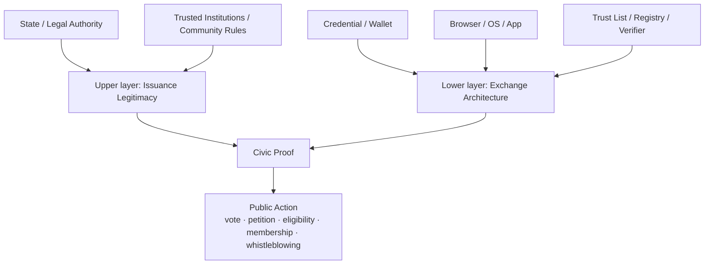
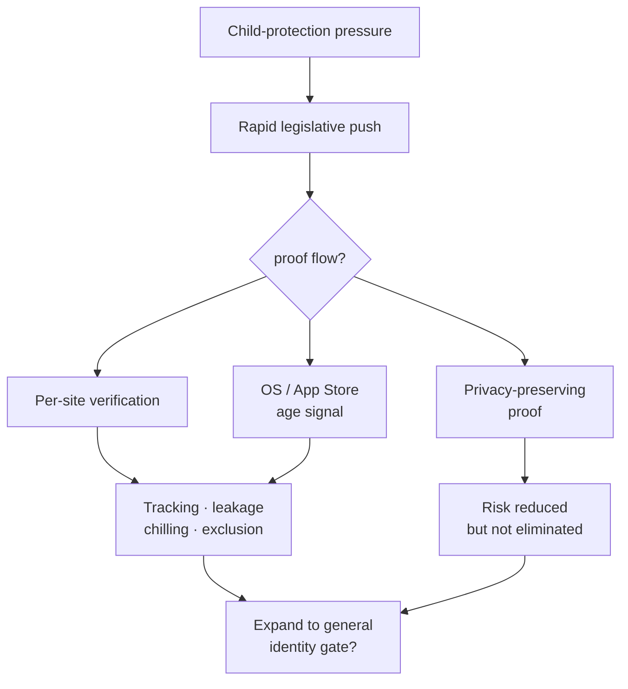
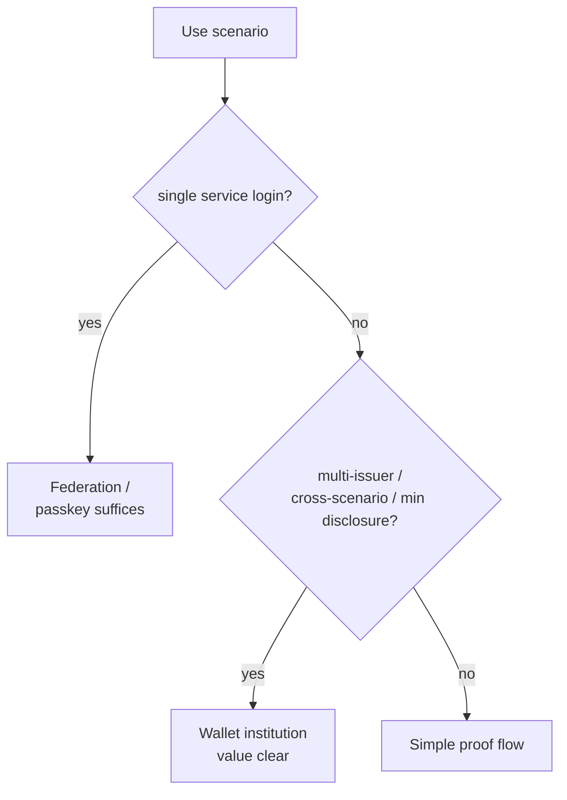
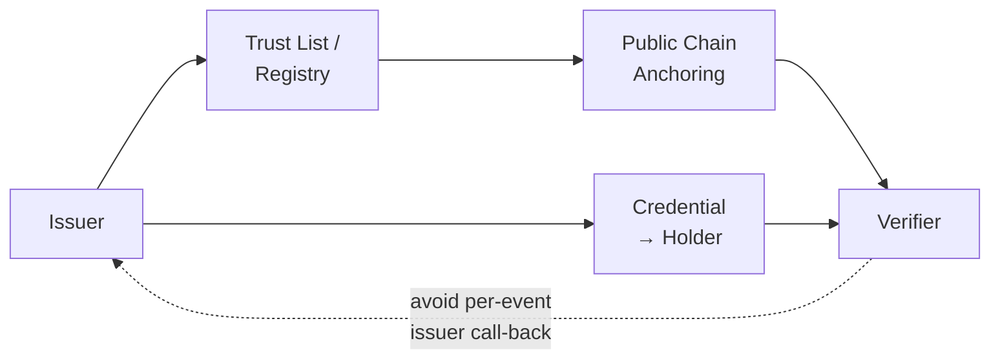

> Presentation slides: [Chinese](https://mashbean.net/blog/allen-lab-share-0417-zh/) | [English](https://mashbean.net/blog/allen-lab-share-0417-en/)
>
> *This essay was first presented on 17 April 2026 at the Allen Lab Fellow Meeting, Ash Center, Harvard Kennedy School. It proposes a framework for evaluating where digital identity meets digital civic infrastructure.*

At the previous Allen Lab meeting, Jeremy McKey took us into Digital Public Infrastructure (DPI) from the angle of Payment. Today I'd like to add the next piece of the puzzle: Identity. If we follow the common DPI tripartite division, the conversation usually lands on three blocks — Data, Payment, and Identity. The Allen Lab has accumulated rich material on Data, and has handled a great many cases of how open data lifts civic action, so today I want to add the last block: digital identity.

I've spent roughly half of the past year on this topic. For the two and a half years before that, I drove and planned digital-wallet work at Taiwan's Ministry of Digital Affairs (moda). After leaving government in mid-2025, I have continued policy research on digital identity, and participated in some civic-scenario experiments — for example, deploying zero-knowledge proofs (ZKPs) as a demonstration, helping open community platforms think through identity integration, and exploring how verifiable eligibility can be established without disclosing a full identity. At the same time, owing to a separate line of work, I have been paying close attention to how diaspora and exile communities are adopting emerging technologies. I had assumed that this would be a digital-democracy topic; I later realised that what kept showing up was digital identity. Eastern Europe, Catalonia, city-level democratic experiments — many of them are bumping into the same question: how can a person prove "enough eligibility" in digital space, without thereby handing themselves over to a state, a platform, or any single intermediary?

What really made these materials cohere for me was the concept of Digital Civic Infrastructure (DCI) that I encountered after arriving at the Allen Lab. I began to realise that what I really care about is not just whether large state projects can be institutionalised, nor only whether commercial services can integrate cleanly. The more central question is whether digital identity can become an infrastructure that supports **civic action**. Can it help people connect, understand, and act, while avoiding over-disclosure, over-tracking, and over-exclusion? Danielle Allen and the Allen Lab understand DCI as a set of [institutional and technical conditions](https://ash.harvard.edu/resources/a-framework-for-digital-civic-infrastructure/) that support citizens in **Connect, Learn, and Act**. My core concern is therefore how digital identity determines whether a person can move from Connect to Act.

I have long held the view that digital tools have produced many success stories at the level of so-called "digital assembly" — digital assembly has even played a significant role in regime transitions in several countries. But "digital association" has never had especially good cases. One important reason, I believe, is that the substrate of "association" — digital identity — lacks a strong foundation. This is an empirically untested hypothesis of mine; the inference is that, because "digital identity is insufficiently private," "the secret associations that digital identity might support" have not been able to take effective form. The effectiveness of digital activism follows the same path.

This essay therefore focuses on a narrower and more political question: what kind of digital-identity architecture allows citizens to act in digital space with low friction, low exposure, and a path to redress. Simply moving credentials onto a phone is, to me, an inevitable result of digital-identity policy evolution and belongs to the realm of public-service digital transformation. The deeper question implicates state power, platform responsibility, civic liberty, cross-border interoperability, and the conditions of entry into the public realm. That is also why I want to put identity back into the DCI context.

## Why Digital Civic Infrastructure Has to Talk About Digital Identity

If we treat DCI as the institutional stack that allows citizens to connect, understand, and act, then the most sensitive position for digital identity emerges at the moment the system begins to **gate action**.

At the **Connect** layer, identity primarily handles persistence, community governance, role allocation, and basic trust — for example, who is who in a community, who can serve as administrator, and who can sustain a long-term record of contribution. My experience at [g0v](https://g0v.tw/) — Taiwan's largest civic-tech community — is that open-source collaborative communities do not really have an action-gating problem, because trust between people is constructed through long-term contribution. The relevant terms are **do-ocracy**, **trust through contribution**, and — from the IETF — **rough consensus and running code**. In such civic-action communities, strong contributors can even be anonymous; digital identity is just a symbolic trust anchor and does not implicate any digital service. There have been many projects attempting to record open-source contribution (e.g., Web3 Hypercerts), but most failed, probably because no quantitative metric can substitute for the social capital that communities accumulate naturally.

At the **Learn** layer, a great deal of information access and discussion does not require strong identity. Reading without login, low-barrier participation in discussion, or participation requiring only weak ties still works in most cases.

The real political pressure lands at **Act**. As soon as a system starts asking whether you are eligible, whether you have voted twice, whether you belong to a particular district, whether you meet the age threshold, whether your participation conforms to procedure, or whether you must bear responsibility for some outcome, digital identity enters the core of **public decision-making**. From that point on, identity is no longer a login detail; it directly enters public resource allocation, the conditions of entry into public space, and the legitimacy structure of digital public life. The DCI framework treats Connect, Learn, and Act as interlinked entry points to civic participation; my observation is that identity intervenes most strongly at Act. That is because Act often abuts public services — whistleblowing, voting, seconding, candidacy, long-term associational governance, and so on.

I therefore want to advance three propositions to continue the argument. First, mainstream digital-identity systems are already quite successful, especially at service delivery, authentication, signing, compliance, and fraud reduction. Second, when identity infrastructure starts to enter age verification, platform governance, and the gateway to public space, it begins to decide who can enter which spaces, and on what conditions users may enter. Third, the maturation of wallets, selective disclosure, unlinkability, ZK, and browser APIs has, for the first time, brought more democratic digital-identity designs into the feasible region of policy and product — but institutional governance is clearly lagging behind technological possibility.

## From Digital Identity to Civic Proof

==Accountability does not need to take real-name identification as a precondition.==

I suggest first splitting digital identity into two layers before we talk about it further. The first layer is the **legitimacy of credential issuance** (issuance legitimacy) — that is, who has the right to issue credentials that produce effects on civic rights and duties (civic consequences). This layer concerns legal effect, sovereignty, institutional accountability, revocation rights, and why a credential is worthy of belief. The second layer is the **exchange architecture** — that is, how credentials are held, how they are presented, who verifies them, how they are revoked, how they are reused across single systems, and whether the process leaves traceable footprints. The former is institutional; the latter is technical; the two are tightly coupled. Once we split them apart, many seemingly tangled debates become much clearer. Public Key Infrastructure (PKI), Verifiable Credentials (VC), wallets, browsers, trust lists, and trust registries each operate at different layers.

The following flowchart shows how this two-layer model converges into civic proof, which in turn supports concrete public action:

I want to introduce a new vocabulary: **civic proof**. The purpose of the term is to shift focus from "the credential itself" to "the proof forms that can support public action." Civic action often does not need a complete **legal identity**. What it needs may be only an **attribute proof** — say, proof that you are over 18, or that you reside in a certain jurisdiction. It may need only a **uniqueness proof** — one person, one vote, one account, defeating Sybil attacks, without needing to know your real name. Moving towards more politically sensitive scenarios, we encounter **pseudonymous participation** — you must be able to participate, to speak, to contribute, and to be auditable after the fact, without having to expose your real identity in the ordinary state. Unless these four demand types are pulled apart first, all subsequent discussion of citizens' use of digital identity in public affairs will be muddied.

Normatively, I check institutions using four conditions, applied differently across demands and across institutional and architectural designs: **anonymity**, **unlinkability**, **verifiability**, and **accountability**.

The following table organises the four civic-proof demand types and their respective requirements on the two-layer architecture:

| Demand type | Typical scenario | What the upper layer needs | What the lower layer needs | Minimum requirements on freedom and privacy |
|---|---|---|---|---|
| **Legal Identity** | Tax filing, legally effective signature, statutory benefits | Root identity authorised by state or law | Strong assurance, revocable, contestable | Verifiable, redressable |
| **Attribute Proof** | Age, residency, student, member | Verifiable attribute source | Selective disclosure, minimum disclosure | Unlinkable, no phone-home |
| **Uniqueness Proof** | One-person-one-account, one-person-one-vote, blue-check on forums | Trustworthy uniqueness source | Deduplication, Sybil-resistant, low disclosure | Pseudonymous, unlinkable |
| **Pseudonymous Participation** | Whistleblowing, sensitive consultation, political discussion | Procedural legitimacy and after-the-fact accountability | Preserve anonymity, preserve auditability | Anonymous, accountable, supervised |

These four conditions must hold simultaneously; they cannot substitute for one another. Among the various emerging digital-identity projects I have participated in, I have found one counter-intuitive but cryptographically (and politically-philosophically?) self-consistent state — **accountability does not need to take real-name identification as a precondition.** This sentence runs through every subsequent section. New institutional space opens up around many problems that were previously thought to be soluble only by full identity disclosure.

## Cross-Country Comparison of Credential Issuance

If we look from the upper layer of issuance legitimacy, high-assurance trust roots that produce digital identity are still, today, mostly provided by states or by institutions recognised by states. This has not really changed. Individual self-issued identities (e.g., Ethereum addresses), civic-group self-issued identities (union, club, association membership), and corporate-issued identities (e.g., Gmail) basically cannot truly satisfy demand for legal proof or attribute proof. In uniqueness proof and pseudonymous participation, many experimental projects have appeared (e.g., the Web3 Gitcoin Passport, although that project has since changed hands and changed direction), but those experiments mostly still adopt state-issued credentials as their foundation (e.g., zkPassport). The main reason, I believe, is that "people — even other countries' people — still trust the sovereign state's power to issue identity more than they trust other roots."

What has truly diverged over the past decade is the lower exchange-architecture layer — how credentials are held, how they are presented, who can verify, who can enter the ecosystem, who controls the trust list, who bears onboarding cost. Differences at this layer directly change whether digital identity can intervene in the DCI Act layer. The historical context that genuinely started the change was COVID-19. Because vaccine passports carried highly sensitive personal data, different standards-setting bodies began proposing the concept of "decentralised identity" against the centralised identity databases stored and used by government, to address the risk of state surveillance. This field subsequently extended into Verifiable Credentials, Decentralized Identifiers (DIDs), and applications of zero-knowledge proofs.

Three primary comparisons:

| | Upper: Issuance Legitimacy | Lower: Exchange Architecture | Current strength | DCI gap |
|---|---|---|---|---|
| 🇹🇼 **Taiwan** | MOICA has legal effect; TW DIW carries a multi-issuer ecology | PKI + wallet / VC dual track | Clear legal effect; policy experimentation flexibility rising | Ecosystem onboarding friction and civic burden coexist |
| 🇪🇺 **EU** | eIDAS trust services, national trusted lists | EUDI Wallet, attestation, selective disclosure | Robust legal framework; formal cross-border interop | Rules are complex; wallets / browsers become new gatekeepers |
| 🇸🇪 **Sweden** | Commercial BankID is de facto infrastructure; state filling in | High daily adoption, platform maturity | High usage frequency, deep social penetration | Single-commercial-operator dependency, inclusion risk |
| 🇺🇸 **USA** | State-level mDL, state laws, state wallets | Mature standards, distributed deployment | Strong OS and market influence | Nationwide institutional fragmentation, inter-state variance |

**Taiwan** simultaneously runs the high-assurance, issuer-centric path of the Citizen Digital Certificate (MOICA) and the wallet path of TW DIW, which moves towards multi-issuer, scenario-based presentation and selective disclosure.

**The EU**'s upper layer remains eIDAS trust services and national trusted lists; its lower layer is integrated by the EUDI Wallet, which brings together attestation, wallet holding, user consent, and cross-border presentation.

**Sweden** is most interesting in that society depends heavily on the commercial BankID and faces concentration risk; the central bank has publicly argued that government e-identification should become an essential complement. This illustrates that commercial identity systems can run very deep into social life, but public-governance questions do not disappear because of it.

A supplementary comparison:

| | Upper: Issuance Legitimacy | Lower: Exchange Architecture | Current strength | DCI gap |
|---|---|---|---|---|
| **[MOSIP](https://mosip.io/)** | Modular identity infrastructure built by each country | Open source, modular, locally deployable | Cost and sovereignty appeal across countries | Civic-rights bearing depends on national governance |
| 🇮🇳 **Aadhaar** | State-level mega-root identity | Authentication / eKYC-oriented | Massive scale and coverage | High scale ≠ high freedom protection |
| 🇧🇹 **Bhutan NDI** | Sovereign-backed National Digital Identity | Trusted wallet, VC-oriented | State-level innovation direction | International interop and governance maturity still forming |

Several more comparisons further afield. The USA is not a single path but a cluster of state-level and market-platform crossovers. California's OpenCred and wallet ecology, and Utah's digital-identity rights language, are worth watching. MOSIP is mostly focused on the Global South and offers a modular, open-source, nationally-owned infrastructure imagination. India's Aadhaar reminds us that large-scale authentication and high coverage are not the same as civic-freedom-first. As for Bhutan, its value lies in the fact that the sovereign-backed National Digital Identity (NDI) path has already integrated trusted wallets and verifiable credentials into a national direction — a high-signal case worth continued observation.

The locus of global competition has expanded from "who has the right to issue identity" to "who controls the trust list, who controls the presentation interface, who bears verifier onboarding and ecosystem cost." The key for digital identity entering DCI is not whether the trust root exists, but the exchange architecture that operates that trust root.

## Taiwan's MOICA (Citizen Digital Certificate) and TW DIW (Digital Identity Wallet)

Taiwan's two policy cases are worth direct comparison, because they contain at once a warning case and a civic-tech testbed.

MOICA is Taiwan's Citizen Digital Certificate — a traditional PKI smart card, later supplemented by mobile-app services. It offers high assurance under the Electronic Signatures Act, clear legal effect, and reasonably clear integration with government processes. For many government-led digital public services, this is very important.

In 2020, the Taiwanese government even tried to integrate MOICA with the physical national identity card, called **New eID** — but [met with substantial public backlash](https://mashbean.net/facebook/2026/0103-miefwt/). The broad consensus was that New eID lacked statutory authorisation and carried information-security risk, and so the plan was eventually suspended. New eID will not be rolled out for the foreseeable future, and inside government it has become a frozen proposal.

Looked at through the DCI frame, MOICA's core problem is not PKI nor the credential itself. The real problem lies in onboarding friction for the open ecosystem, application eligibility, in-person counter procedures, third-party integration cost, and the overall issuer-centric design. MOICA's official identity-verification service even explicitly requires application systems to apply and be approved before they can obtain relevant capabilities. This design is well suited to highly controlled and highly accountable scenarios, but friction is high for third-party civic services.

TW DIW walks a different path. Its official route is not to issue another centralised national digital identity, but to convert existing government and private-sector credentials into digital cards that holders can manage. TW DIW has previously open-sourced its issuer and verifier modules, and today (17 April 2026) open-sourced the source code of its mobile app — an important milestone. There is currently a telecom-carrier card, supporting pickup of e-commerce parcels at convenience stores. Future support should extend to business certificates and driver's licences.

TW DIW's policy design emphasises selective disclosure, interoperability, an open ecosystem, and the possibility of multi-issuer / multi-verifier arrangements. This makes it very promising in DCI terms, because civic action often does not need highly controlled central identity but rather proofs that are more convenient, more composable, and lower in disclosure.

That said, the civic-tech application problems raised by TW DIW — how citizens use digital wallets to amplify their action — cannot be understood merely as adoption barriers. More precisely, the issue is **civic burden redistribution**. Because DIW can accommodate digitally issued identities from multiple institutions, multiple trust roots, multiple trust lists, and multi-issuer ecosystems certainly expand ecosystem possibilities — but they also more heavily transfer the costs of comprehension, authorisation, verification, complaint, and responsibility attribution onto the public and onto verifiers.

The following table contrasts the two systems on key DCI dimensions:

| Dimension | MOICA (Citizen Digital Certificate) | TW DIW (Digital Identity Wallet) |
|---|---|---|
| **Design centre** | Issuer, legal effect, identity recognition, e-signature | Holder, cross-scenario reuse of credential cards |
| **Typical task** | Identity recognition, digital signature, encryption/decryption | Attribute presentation, cross-scenario credentials, selective disclosure |
| **Third-party integration** | Formal application, review, and approval required | Sandbox more open; issuer / verifier entry broader |
| **Disclosure logic** | High-strength confirmation, even full identity disclosure | Per-scenario authorisation and minimum disclosure |
| **Main friction** | Counter visits, eligibility, API review, integration cost | User comprehension, verifier integration, trust-list governance |
| **DCI implication** | A strong credential is enough to support government processes, but not necessarily enough to support civic action | Application space enlarged; civic burden also distributed across citizens and verifiers |

MOICA's friction is concentrated **before** entry — application, review, integration. TW DIW's friction is concentrated **during** ecosystem operation — how you understand the credential in your hand, whether you trust the issuer, how a verifier verifies, who is responsible when disputes arise. This matters for DCI, because civic infrastructure is not only about whether the technology runs but also about a whole distribution of usage and accountability cost.

Two cases currently underway illustrate how the civic-tech community is applying these existing public services for civic action.

### Case A: PTT Using MOICA for Anonymous Locale Proof

PTT, Taiwan's largest BBS, still has hundreds of thousands of users, but the platform has long been troubled by coordinated election-period behaviour and "cyber army" operations that volunteer teams struggle to address through traditional content moderation. This year (2026) is a year of local elections in Taiwan; the engineering team uses MOICA to generate zero-knowledge proofs that let users earn a "blue check" without disclosing their real identity, reducing the frequency of "cyber army" attacks. This case demonstrates that a state root certificate can provide the trust root without handing the full identity over to the platform, and without the platform needing to know who specifically is behind the proof. This is a concrete path from state credentials to civic proof.

### Case B: g0v Summit Issuing Entry Credentials via TW DIW

Another important direction is g0v Summit 2026. g0v is Taiwan's largest civic-tech community, holding a biennial summit. This year the g0v volunteer team will use TW DIW to issue badges and entry credentials, with non-governmental third parties acting as issuer and verifier. This will directly demonstrate that a holder-centric ecosystem need not be operated by the state alone. Civic communities, event organisers, and unofficial verifiers can also operate within the trust framework. It forms a contrast with the PTT case: the former uses a strong state credential to produce a low-disclosure civic proof; the latter uses a wallet architecture to enlarge the practical space for non-governmental issuance and verification.

## Age Verification Is the Best Stress Test for National Digital-Identity Policy

I believe age verification can easily slide from "child-protection" into generalised access control. This is also why age verification is the most tension-laden part of "digital identity as public infrastructure." It pushes back-office identity infrastructure directly to the gateway of public space and discourse. When a person seeks to enter a service, a discussion space, a content type, or a social interaction, and the system first demands proof of age, identity has formally intervened in the conditions of entry into public space.

The pace of this wave of age-verification legislation is clearly faster than that of technical standards and human-rights assessment. Before *ISO/IEC 27566-1* — the first international standard for age verification — was published in December 2025, multiple US states had already legislated, the UK had begun enforcement, and Australian law had already entered into force. More importantly, the standard itself states explicitly that the goal of age verification is age-related eligibility determination, and that "obtaining age assurance" does not necessarily require establishing a full identity.

The following table summarises age-verification trends in four primary jurisdictions:

| | Institutional trend | Key dates | Core tension |
|---|---|---|---|
| 🇬🇧 **UK** | Ofcom requires highly effective age assurance, permits multiple technical paths | From 2025-07, pornographic sites must use strong age checks | High regulatory intensity, but privacy standards are not uniform |
| 🇦🇺 **Australia** | Social-media minimum age, platforms must take reasonable steps | Entered into force 2025-12; compliance update 2026-03 | Platform liability, effectiveness, false blocks |
| 🇪🇺 **EU** | Age verification app / blueprint integrated with EUDI route | 2025 blueprint; deployable 2026-04 | Whether minimum disclosure can be institutionalised |
| 🇺🇸 **USA** | From state-level content gates to device / OS / app-store age signals | 2025-06 *Paxton*; 2025-10 California AB1043 | Sliding from "porn gate" to "infrastructure-layer age signal" |

The UK, Australia, and the EU offer three mature but different comparison paths. Ofcom's model is high regulatory intensity plus technological neutrality. It requires age verification to be technically accurate, robust, reliable, and fair, listing methods such as open banking, photo-ID matching, facial age estimation, mobile-operator age checks, credit-card checks, digital-identity services, and email-based age estimation. The strength of this approach is high flexibility; the weakness is that platforms tend to choose the cheapest, easiest-to-deploy option, and the cheapest is not necessarily the most privacy-friendly. Australia emphasises platform liability and post-implementation supervision; after entry into force on 10 December 2025, eSafety released a compliance update in March 2026, continuing to assess whether platforms have taken sufficient reasonable steps. The EU direction tries to institutionalise "only prove that one is over eighteen" as a design pattern; in April 2026, the European Commission announced that the age-verification app is deployable, initialised via passports or identity cards.

In the US, on 27 June 2025, the Supreme Court ruled 6–3 in *Free Speech Coalition v. Paxton* that Texas's adult-content age-verification law was constitutional. The majority opinion explicitly states that age proof is a typical and appropriate means of enforcing age restrictions. This is a critical turn, because it shifted age verification — long considered a highly suspect burden on speech — into a more readily accepted constitutional means, at least in the context of "sexual content harmful to minors." The Electronic Frontier Foundation (EFF) cautioned shortly thereafter that the ruling's legal reasoning is in fact limited to sexual content to which minors have no right of access, and does not automatically authorise broader age gates on social media, general websites, or app stores. The legal range is limited; the policy momentum has not stopped there.

The *Paxton* legal logic is confined to a specific content category, but policy implementation has moved rapidly into deeper layers. California's AB1043, the *Digital Age Assurance Act* signed in 2025, requires operating-system providers to ask account holders for the user's date of birth or age at account creation, and to provide developers with age-bracket signals through a real-time API. More critically, developers must request the signal at app download and launch. This means age verification is no longer just a content gate for certain websites but is sinking into the infrastructure layer of devices, operating systems, and app distribution. The California law also adds protective clauses: only minimum necessary information is transmitted, and compliance data may not be used for anti-competitive purposes. Illinois's *Digital Age Assurance Act* proposal, while not yet passed, follows the same direction of writing age signals into device, OS, and app-store layers. Putting these cases together makes the picture clear: the genuine US turning point is not a single adult-content ruling but the shift from content gates to infrastructure-layer signals.

I want to add a fifth, implicit question. The first four are familiar: who issues the proof, how much information is disclosed, can it be tracked, how is redress provided. The deeper one is: "Does it expand from controlling specific content to broad identity gating?" How do we avoid **structural slippage**? California AB1043's age-signal model, the UK's expansion from the *Online Safety Act* to broader wallet and digital-identity discussion, the EU's case of placing age verification into the EUDI Wallet, and the US state-level laws moving from adult sites to social media and device-layer signals — all point in the same direction: once the infrastructure is built, new policies will tend to free-ride.

Age verification creates impact along at least four axes:

| Rights dimension | Risk pattern |
|---|---|
| **Privacy** | Documents, age, biometrics centrally processed |
| **Anonymity** | Lawful browsing conflicts with the right to remain anonymous |
| **Free speech** | Adults forced into self-censorship (chilling effect) |
| **Digital divide** | Undocumented / unbanked persons excluded |

The following flow chart shows possible paths and risks from child-protection pressure:

There is also the information-security risk of centralised third-party age-verification providers. In 2025, Discord acknowledged that, in an incident affecting its third-party vendor 5CA, government-ID photographs used by approximately 70,000 users for age-related appeals may have been exposed. Tea, AU10TIX, IDMerit, and others can be added to the list. The common thread is that when age verification adopts centralised document upload and outsourced services, it forms a high-value attack target. So this section is not only about constitutional speech burden but also about operational-security burden.

Good designs do exist. France's double-anonymity scheme, the EU's app and EUDI route, and Spain's earlier ZK-based age-verification experiments all illustrate that age verification need not equal full identity upload. EUDI's architecture documents explicitly note that selective disclosure, user approval, no-tracking, and even a ZK-based "I am over eighteen" proof are considered legitimate directions. For a complete policy analysis, see my [age verification and digital rights report](https://pro.mashbean.net/reports/2026-04-16-age-verification-digital-rights/).

## From Full Identification to Minimal Proof

Age verification is an excellent case showing what happens when "policy" outruns "technology."

Age verification is a typical attribute proof. There are two digital-identity solutions to such proofs: **full identification** and **minimal proof**. The following table compares the two:

| Question | Full identification | Minimal proof |
|---|---|---|
| Are you 18? | Disclose date of birth, full credential | Prove only "over 18" |
| Do you live in a place? | Disclose full address or household registration | Prove only residency eligibility |
| Are you the same person? | Hand over real name, ID number | Uniqueness proof or pseudonymous credential |
| Do you have a certain qualification? | Hand over the entire credential | Disclose only the specific attribute |

Technical maturity today is no longer a question of feasibility but of which scenarios should treat minimal proof as the default. Often we need only to establish whether one condition holds — over 18, residency in a district, student status, membership of a body. A system that requires full identification every time institutionalises over-disclosure. By contrast, when systems design proof flows through selective disclosure, unlinkability, and no-phone-home, digital identity has a chance to support more democratic public-space governance.

The following decision tree may help determine when a wallet is needed:

Is a wallet necessary? My answer is conditional. If the need is single-service login, federation (e.g., Sign in with Google), passkeys, or existing high-assurance login tools are often enough. When the need becomes multi-issuer, cross-scenario reuse, minimum disclosure, user consent, and cross-border interop, the institutional value of a wallet rises significantly — because the wallet is no longer just a container but also bears presentation, consent, credential management, and the composition logic across different issuers. NIST's inclusion of "subscriber-controlled wallets" in its model is precisely an acknowledgement of this.

I also want to emphasise that "the presentation layer is rapidly platformising." When wallets, operating systems, and browsers begin to become the default gateway for digital credentials, real competition expands from "who issues the identity" to "who controls the presentation and consent interface of identity." Google Wallet, Chrome, Apple Wallet, EUDI's browser-mediated presentation — all are moving in this direction. This means the platform layer is no longer neutral. It may become a new gatekeeper, or a new locus of rights protection. The EUDI's restrictions on browsers and operating systems, and Google's framing of no-server-tracking, both signal that this layer is being institutionalised.

Finally, the Privacy and Scaling Explorations (PSE) team at the Ethereum Foundation deserves mention. Because minimal proof is tied to zero-knowledge proofs, if minimal proof is to enter genuinely usable civic scenarios, standards alone are not enough; there must also be breakthroughs in client-side proving performance, usable revocation design, and the engineering effort needed for phones and consumer devices to bear the proof. PSE has put client-side proving and zkID on its roadmap, and in 2026 continues to discuss GPU acceleration and revocation mechanisms, making ZK no longer just a research language but a technological foundation that products and civic experiments can rely on.

## Civic and Sub-National Experiments

When mainstream institutions do not adequately support low-exposure, portable, verifiable civic proofs, civic and sub-national experiments emerge. The most important value of these projects is not that they prove alternative identity regimes are mature, but that they expose unmet demands the mainstream has not adequately served.

| Case | Trust root | What it reveals | Where it remains weak |
|---|---|---|---|
| **[Vocdoni](https://vocdoni.io/)** 🇪🇸 Catalonia | Local government, organisational membership boundary, passport | Verifiable, auditable, privacy-first digital voting demand | Legal effect, adoption, cross-jurisdictional scaling |
| **[Rarimo](https://rarimo.com/) Freedom Tool** 🇷🇴🇷🇺🇮🇷 | Passport-rooted, ZK proof | Anonymous eligibility proof in exile / authoritarian contexts | High dependence on passports and a specific tech stack |
| **[QuarkID](https://quarkid.org/)** 🇦🇷 Buenos Aires | City-level government, public-sector trust framework | Demand for a city-level public digital trust framework | City-to-state extrapolation should be conservative |

**[Vocdoni](https://vocdoni.io/)** is a technology-development non-profit in Catalonia. Since the failure of the 2017 Catalan independence referendum, Catalan political activity has faced severe constraints, and many emerging organisations have explored new forms of civic participation. Vocdoni uses "Spanish passport" verification to confirm that the holder is "Catalan" for simulated votes. The Vocdoni case tells us that local government and civic organisations genuinely need verifiable, auditable, privacy-first digital voting tools.

**Rarimo** also converts passports into anonymous digital identity for simulated voting. Rarimo has run small-scale simulated votes in Romania, Russia, and Iran. In exile communities and authoritarian contexts, passport-rooted, ZK-based anonymous eligibility proof has real demand.

**QuarkID** shows that city-level government is also experimenting with putting digital trust frameworks and citizen-controlled credentials into public governance.

I want to take a very moderate position. These cases are better treated as demand evidence, not as complete-replacement evidence. They mostly still rely on existing passports, membership boundaries, local-government documents, or other institutional trust roots. The root identity still needs public legitimacy and democratic accountability; the branching outward increases flexibility but weakens the trust base. From this angle, the more likely future is not the comprehensive replacement of state root certificates but the combination of state root certificates with civic-layer participation tools.

There is also a deeper political question — how to make citizens believe that government-issued credentials will not become tools for the government to track citizens. This is in fact the most important implicit question in many civic experiments. If citizens believe the credential is only a trust root, and that the verification process itself will not transmit transactions back to the state, acceptance is wholly different. That is also why **no-phone-home** and **unlinkability** are so important.

## Where Public Blockchains Fit

Among emerging digital-identity services, one option has long been in standards plans but has hardly been adopted by any state: the public blockchain. This is, I think, the most important and at the same time the most restraint-requiring section. Public blockchains carry high institutional imagination in digital-identity services, but few national cases of real large-scale deployment exist; at present only Bhutan and Taiwan have actually implemented it.

My view is that the institutional value of public blockchains lies not in legitimacy itself, nor in putting personal data on chain. The most suitable position is the trust layer, status anchoring, cross-organisation visibility, and auditable status publication.

| Element | Suggested location | Why |
|---|---|---|
| **Personal data** | Off-chain, local wallet | Protect privacy, avoid irreversible linkage |
| **Issuer DID / public keys** | Public registry or on-chain anchoring | Enables independent cross-org verification |
| **Trust-list anchor** | Publicly verifiable infrastructure | Auditable, jointly visible, single-point-failure resistant |
| **Single verification events** | Avoid per-event call-back to issuer | Reduces phone-home risk |

The following flow chart shows the suggested location of public blockchains within the digital-identity trust chain:

I am not talking about putting personal data on chain. Whether viewed through GDPR, privacy, unlinkability, or practical data governance, putting personal data itself on chain is not a good direction. What is more reasonably put on chain is the issuer's DID, public keys, trust-list anchor, status-list commitment values, or other publicly verifiable but not directly identifying data. This allows holders and verifiers to confirm whether an issuer is trustworthy without calling the issuer for each event — which is critical for civic proof, because it reduces centralised query and the possibility of phone-home.

Why do I emphasise public blockchains and not distributed ledger technology generally? In mature existing infrastructure, public blockchains are one of the few tools that simultaneously offer permissionless publication, cross-organisation visibility, independent verification, and stronger single-point-failure resistance. This is especially appealing in cross-jurisdictional, civic-community, sub-national governance, and city-level trust frameworks. Conversely, permissioned consortium infrastructure has value in coordination efficiency within a specific jurisdiction or alliance, but its node governance and global verifiability logic differ entirely. Taking the EU trust lists, their core value comes from law and supervision; if a public chain is placed here, the most reasonable role looks more like a trust layer and registry interface, not a replacement for legal legitimacy itself.

This is also why I suggest understanding interoperability through a **federated trust-list alliance**. The future feasible direction is more likely not a single global trust root but trust lists across different jurisdictions, cities, institutions, and communities bridging one another to form a network that can be connected, audited, and tier-governed. Towards that end, I spent a year participating in an ICANN research-fellow programme to understand how the DNS trust root was built. The conclusion is that DNS took a path totally different from that of state power; the twelve trust roots are still, to a great extent, not state-managed. Given the vastly different historical context, I think it is hard to reproduce in digital identity.

## Policy Agenda: From DPI to DCI

In my work experience, advancing DCI from the government side is extraordinarily difficult. Although a few years ago I did not know the term DCI, the practical path was similar. I have found that the hardest part is not technical application, but rendering "technical architecture" and "political-philosophical ideals" into action language that civil servants and civic groups can understand — into procurement requirements, milestone checkpoints, and even the policy lexicon that "the current government" can adopt. And this is an extremely specialised area in which experts from different fields rarely intersect. Political workers, technocrats, technical workers, and system integrators (SIs) use markedly different languages — although all in Chinese, I sometimes feel I am living in different cultural worlds.

I therefore try to list the most important principles to ensure that, in digital identity, DPI successfully transforms into DCI. Below are five operational directions:

| Layer | Concrete policy action | Mappable cases | Why it matters |
|---|---|---|---|
| **Rights baseline** | Minimum disclosure, unlinkability, no phone-home, voluntariness, alternative paths, redress | ACLU, EFF, CDT No Phone Home, EU browser restrictions | Without a floor, every new use case starts from maximum visibility |
| **Platforms and standards** | Open wallets, standardised provisioning, avoid single-platform lock-in | Chrome DC API, TW DIW OID4VC/OID4VP, CA OpenCred | The presentation layer is becoming a new gatekeeper |
| **Procurement and rollout** | Procurement sandbox, third-party testing, exit clauses, incident response | Verifier onboarding, module-substitution testing | Rights without procurement language disappear at rollout |
| **Public-interest pilots** | Small-scale experiments with concrete civic-use scenarios | Forum blue checks, event credentials, local consultation | Prove civic proof works before talking about full rollout |
| **AI delegation** | Scope limitation, revocability, auditability, human override | OpenID agent identity, NIST AI agent concept | The identity question shifts from "who logs in" → "who can act on whose behalf" |

### 1. Fix the Privacy-First Baseline

This must include at least minimum disclosure, unlinkability, no phone-home, voluntariness, paper-or-non-smartphone alternative paths, and clear complaint redress. These principles align with the digital-rights direction of the ACLU, EFF, and Access Now. Without fixing such a floor, almost every new use case will start from maximum visibility, easiest manageability, and easiest datafication.

### 2. Require Open Wallets and Standardised Provisioning

Because the presentation layer is becoming the new gatekeeper. If the wallet, OS, and browser layers are dominated by single platforms, digital identity will move from state monopoly to platform monopoly. TW DIW's official app uses OID4VC / OID4VP at its core; Chrome is bringing the Digital Credentials API into implementation; California handles the verifier ecosystem through OpenCred — these provide observable material. Policy should standardise provisioning, presentation, and verifier onboarding as far as possible, to avoid forming a new closed ecology.

### 3. Build a Procurement Sandbox

This is easily overlooked but, in my view, very important. Many rights claims look beautiful in policy white papers and disappear once implementation begins. The reason is that they have not been translated into procurement language. What truly needs to be tested is whole-life-cycle cost, third-party testing, incident response, module-substitution capability, exit clauses, and the real friction of verifier onboarding. In other words, rollout is not the last step; it is itself part of institutional design, and — because procurement is overly process-driven — it is very easily overlooked. For the structural problems of government IT procurement, see my [government IT procurement: monopoly or innovation report](https://pro.mashbean.net/reports/2026-03-28-gov-it-procurement-monopoly-or-innovation/).

### 4. Build a Testbed Network

I do not recommend pursuing universal digital identity from the start. A more robust move is to pick several civic-use scenarios for small-scale, comparable experimentation. Uniqueness proof in forum or public discussion spaces is one. Minimum-disclosure proof of age or residency is one. Membership proof for civic self-government or civic groups is one. If these pilots can produce comparable, evaluable, and diffusable material, they will also contribute to the research environment concerned with DCI.

### 5. Bring AI-Agent Delegation Into the Main Line

AI agents are rapidly entering human work and life. The biggest question in the next phase shifts from "who logs in" to "who may act on whose behalf." Whether an AI agent can query, purchase, sign, vote, submit data, or operate some civic workflow on my behalf requires scope limitation, revocation, auditability, and human override. The OpenID Foundation and NIST have already written this into formal documents; agentic identity and delegated authority must be brought back into the main agenda of digital identity. For a complete analysis of AI agent identity governance, see my [Agentic ID Governance report](https://pro.mashbean.net/reports/2026-04-01-agentic-id-governance/).

## Conclusion

**A digital-identity system that a democratic society needs must do more than prove who I am. It must also decide when I can refrain from exposing more than necessary, and still participate lawfully in public life.**

From the DCI perspective, the core question of digital identity is not only how to make every person more easily recognisable. The more important question is how to convert legitimately rooted eligibility sources into low-barrier, low-exposure, redressable civic proofs. This conversion runs through the two-layer trust model. The upper layer is issuance legitimacy; the lower layer is the exchange architecture. The world today shows that mainstream state identity systems are very good at supporting government services, signing, compliance, and platform integration; the weaker parts are typically pseudonymous participation, unlinkability, redress, and low-barrier civic reuse. Connect, Learn, Act helps me see that the place where identity truly enters the core is when the system begins to gate action.

I want to leave several questions to the reader. First, which civic behaviours really need legal identity, and which need only attribute proof, uniqueness proof, or pseudonymous participation? Second, if wallets, operating systems, and browsers gradually become the default presentation layer, have they not already become a new public infrastructure? Third, if state root certificates remain the mainstream into the foreseeable future, what exchange architecture is sufficient to support the privacy, portability, redress, and inclusion that a democratic society needs?

---

## References

### Standards and Specifications

- **[W3C Verifiable Credentials (VC)](https://www.w3.org/TR/vc-data-model-2.0/)** — W3C Verifiable Credentials Data Model 2.0
- **[W3C Decentralized Identifiers (DID)](https://www.w3.org/TR/did-core/)** — W3C Decentralized Identifiers (DIDs) v1.0
- **[ISO/IEC 27566-1](https://www.iso.org/standard/80396.html)** — Age assurance systems — Framework (2025)
- **[OID4VC / OID4VP](https://openid.net/sg/openid4vc/)** — OpenID for Verifiable Credentials / Verifiable Presentations
- **[Digital Credentials API](https://wicg.github.io/digital-credentials/)** — W3C / WICG Digital Credentials API (Chrome implementing)
- **[NIST SP 800-63-4](https://pages.nist.gov/800-63-4/)** — Digital Identity Guidelines, incl. subscriber-controlled wallets model

### National and Regional Institutions

- **[eIDAS 2.0 & EUDI Wallet](https://digital-strategy.ec.europa.eu/en/policies/eudi-wallet-toolbox)** — EU Digital Identity Wallet framework
- **[MOICA](https://moica.nat.gov.tw/)** — Taiwan Citizen Digital Certificate (MOI Certificate Authority)
- **[TW DIW](https://www.diw.gov.tw/)** — Taiwan Digital Identity Wallet (Ministry of Digital Affairs)
- **[BankID](https://www.bankid.com/)** — Swedish commercial electronic identification system
- **[MOSIP](https://mosip.io/)** — Modular Open Source Identity Platform
- **[Aadhaar](https://uidai.gov.in/)** — India's unique identity system (UIDAI)
- **[NDI Bhutan](https://ndi.gov.bt/)** — Bhutan's National Digital Identity
- **California AB1043** — California age-verification act (OS-layer age-bracket signal)
- **California OpenCred** — California open credential verifier ecosystem
- **Utah Digital Identity** — Utah digital identity rights legislation

### Civic and Sub-National Experiments

- **[Vocdoni](https://vocdoni.io/)** — Catalan digital voting infrastructure
- **[Rarimo](https://rarimo.com/)** — Passport-rooted anonymous eligibility proof and simulated voting
- **[QuarkID](https://quarkid.org/)** — Buenos Aires city-level digital identity project
- **[zkPassport](https://zkpassport.id/)** — Passport-chip-based zero-knowledge proof identity
- **PTT ZK blue check** — Taiwan's PTT using MOICA to generate ZK verification marks

### Technology and Research

- **[Ethereum Foundation PSE](https://pse.dev/)** — Privacy and Scaling Explorations, incl. client-side proving and zkID research
- **[Hypercerts](https://hypercerts.org/)** — Open-source contribution recording experiment (Web3)
- **Gitcoin Passport** — Decentralised identity aggregation experiment (changed hands)

### Advocacy and Research Institutions

- **[Ash Center for Democratic Governance and Innovation](https://ash.harvard.edu/)** — Harvard Kennedy School, [Digital Civic Infrastructure framework](https://ash.harvard.edu/resources/a-framework-for-digital-civic-infrastructure/)
- **[ACLU](https://www.aclu.org/)** — American Civil Liberties Union
- **[EFF](https://www.eff.org/)** — Electronic Frontier Foundation
- **[Access Now](https://www.accessnow.org/)** — International digital-rights advocacy organisation
- **[ICANN](https://www.icann.org/)** — Internet Corporation for Assigned Names and Numbers, DNS trust-root governance
- **[IETF](https://www.ietf.org/)** — Internet Engineering Task Force, "rough consensus and running code"
- **[OpenID Foundation](https://openid.net/)** — incl. agentic identity and delegated authority topics

### Further Reading

- [Age verification and digital rights](https://pro.mashbean.net/reports/2026-04-16-age-verification-digital-rights/) — How age-verification legislation quietly constructs global identity infrastructure
- [Government IT procurement: monopoly or innovation](https://pro.mashbean.net/reports/2026-03-28-gov-it-procurement-monopoly-or-innovation/) — Structural problems of government IT procurement
- [Agentic ID Governance](https://pro.mashbean.net/reports/2026-04-01-agentic-id-governance/) — Governance framework for AI-agent identity
